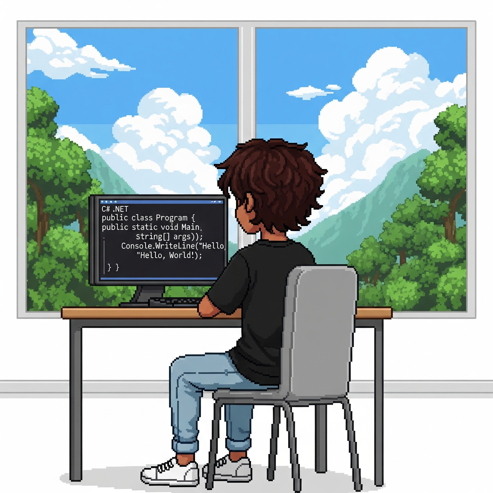

  

 

---

## 👤 Pedro Juan

  
  

    Estudante de Análise e Desenvolvimento de Sistemas (ADS), cursando o 4º período e focado em tecnologias Back-End. Atualmente, aprimoro minhas habilidades com a plataforma .NET e a linguagem C#.
    
    
    

  Busco minha primeira oportunidade profissional na área de desenvolvimento, com um forte interesse em **Cibersegurança** e **Gerenciamento de Banco de Dados**.
     
  Transformando ideias em código funcional, um passo de cada vez.

    
    
  Conecte-se
    
   
   
  
    
  
  

  

---

## 🛠️ Linguagens e Ferramentas

Tecnologias principais que utilizo e foco de estudo:

  
  
  
  
  
  
  
  
  
  

 

---

## 📊 Estatísticas e Projetos

  

    Confira alguns dos meus projetos destacados:
  

  
  
  &nbsp;
  
  
    
  
  <picture>
    <source media="(prefers-color-scheme: dark)" srcset="https://raw.githubusercontent.com/PedroJuanAFK/PedroJuanAFK/output/github-contribution-grid-snake-dark.svg">
    <source media="(prefers-color-scheme: light)" srcset="https://raw.githubusercontent.com/PedroJuanAFK/PedroJuanAFK/output/github-contribution-grid-snake.svg">
    
  </picture>

